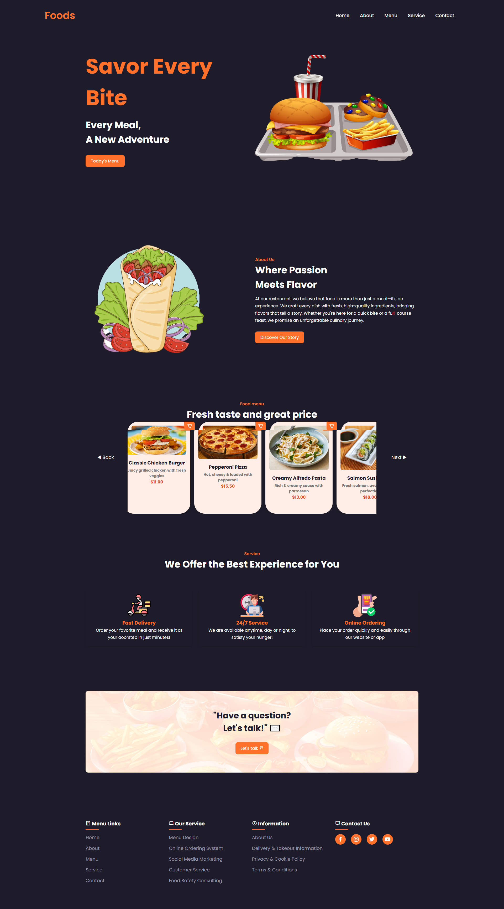

# 🎬 Projeto: Food Website

## ✨ Descrição  

Este projeto é um website interativo para um restaurante de fast food, desenvolvido com foco em usabilidade, interatividade e design responsivo. A interface inclui um menu dinâmico, um carrossel de destaque para pratos populares e modais informativos que apresentam a história da empresa e um formulário de contato. Para garantir uma experiência fluída e envolvente, foram aplicadas técnicas de manipulação do DOM, animações CSS e estruturação semântica do código, além da adoção de boas práticas de desenvolvimento frontend para manter um código limpo, organizado e escalável.

Principais funcionalidades 🔽
✅ Menu responsivo e interativo 🍔 para facilitar a navegação.
✅ Carrossel deslizante 🎠 com rolagem automática e navegação manual.
✅ Modais dinâmicos 💬 para exibição da história da empresa e formulário de contato.
✅ Design responsivo 📱 garantindo compatibilidade com diferentes dispositivos.

- [Acesse o projeto finalizado, online](https://alex518123.github.io/Food-Website)

---

## 🛠️ Tecnologias Utilizadas  
As principais tecnologias aplicadas neste projeto foram:  

- **HTML5** 📄 para a estrutura da página  
- **CSS3** 🎨 para estilização e responsividade  
- **JavaScript (ES6+)** ⚡ para interatividade  

---

## 🎯 Objetivo
Este projeto foi desenvolvido para fortalecer minhas habilidades em HTML, CSS e JavaScript, garantindo um código mais limpo, modular e de fácil manutenção.

---

## 📸 Capturas de Tela  
  

---

## 🚀 Funcionalidades  
🔹 **Menu interativo:** Abre e fecha ao clicar no ícone.  
🔹 **Carrossel automático:** Move as imagens a cada 4 segundos e permite controle manual.  
🔹 **Modais dinâmicos:** Abrem e fecham ao clicar nos botões de ação.  
🔹 **Navegação fluída:** Rolagem suave e responsiva para melhor experiência do usuário.  

---

## 📂 Estrutura do Projeto  

📁 Food-Website
 ├── 📄 index.html
 ├── 🎨 styles.css
 ├── ⚡ script.js
 ├── 📁 assets/  

---

## 📦 Como Usar  
1️⃣ Clone o repositório:  
```sh
git clone https://github.com/alex518123/Food-Website.git

2️⃣ Abra o arquivo index.html no navegador.

3️⃣ Divirta-se explorando as funcionalidades! 🚀

---

🤝 Contribuição
Contribuições são bem-vindas! Para contribuir:

1️⃣ Faça um fork do projeto 🍴
2️⃣ Crie uma nova branch: git checkout -b minha-feature
3️⃣ Faça suas alterações e commit: git commit -m "Minha melhoria"
4️⃣ Envie um pull request 📩

---

📬 Contato

📧 **E-mail:** alexresende675@gmail.com
🐙 **GitHub:** [alex518123](https://github.com/alex518123)

---

📝 Licença
Este projeto está sob a licença MIT. Consulte o arquivo LICENSE para mais detalhes.

---

Desenvolvido por: Alexander Resende [Dê uma olhada no meu portfólio!]()
